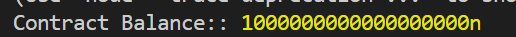
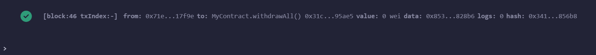

# MyContract Project

## Description
`MyContract` is a smart contract built with Solidity that provides the following functionalities:
1. Accept ETH through the `receive` and `fallback` functions.
2. Display the current balance of the contract using the `getBalance` function.
3. Allow the contract owner to withdraw all ETH from the contract balance using the `withdrawAll` function.


---

## Team Members
This project was developed by the following team members:
1. **Amanbayev Marlen** 
2. **Nagumanov Azamat** 
3. **Tuspekova Gulzhan** 

---

## Project Structure
The project is organized as follows:

```
MyProject/
├── MyContract.sol  // Solidity smart contract
├── interact.js     // Node.js script to interact with the contract using web3.js
├── package.json    // Node.js project configuration
├── package-lock.json
├── README.md       // Documentation for the project
├── LICENSE         // License file
```

---

## Installation
To set up and run the project, follow these steps:

### Prerequisites
- [Node.js](https://nodejs.org/) installed on your system.
- [Ganache](https://trufflesuite.com/ganache/) to create a local blockchain.
- [MetaMask](https://metamask.io/) installed as a browser extension.

### Steps
1. Clone the repository:
   ```bash
   git clone https://github.com/YOUR_USERNAME/YOUR_REPOSITORY_NAME.git
   cd YOUR_REPOSITORY_NAME
   ```

2. Install dependencies:
   ```bash
   npm install
   ```

3. Start Ganache:
   - Open Ganache and start a new workspace or use the default one.
   - Make sure it is running at `http://127.0.0.1:7545` (default RPC).


4. Deploy the smart contract:
   - Open [Remix](https://remix.ethereum.org/).
   - Copy the `MyContract.sol` file into Remix and compile it.
   - Set the environment to **Injected Web3** in Remix.
   - Deploy the contract and copy the contract address.


5. Configure the script:
   - Open `interact.js`.
   - Replace the placeholder `contractAddress` with the actual deployed contract address.
   - Replace the placeholder `abi` with the actual ABI of the contract (copy it from Remix).

6. Run the interaction script:
   ```bash
   node interact.js
   ```

---

## Usage

### Interacting with the Contract
1. **Check Contract Balance**:
   - Run `node interact.js` to call the `getBalance` function.
   - Example output:
     ```
     Contract Balance: 1000000000000000000n
     ```

2. **Send ETH to the Contract**:
   - Use Remix or any wallet (e.g., MetaMask) to send ETH to the contract address.

3. **Withdraw ETH from the Contract**:
   - Call the `withdrawAll` function through the `interact.js` script.
   - Only the owner of the contract can execute this function.

4. **Expected Results**:
   - Before withdrawal:
     ```
     Contract Balance: 1000000000000000000n
     ```
   - After withdrawal:
     ```
     All funds withdrawn.
     Final Contract Balance: 0n
     ```

---

## Example Outputs
### Before Withdrawal:
```bash
Contract Balance: 1000000000000000000n
```


### After Withdrawal:
```bash
All funds withdrawn.
Final Contract Balance: 0n
```


---

## Dependencies
This project uses the following tools and libraries:
- [Solidity](https://soliditylang.org/) for writing the smart contract.
- [Ganache](https://trufflesuite.com/ganache/) for local blockchain development.
- [web3.js](https://web3js.readthedocs.io/) for interacting with the blockchain.
- [Node.js](https://nodejs.org/) for running the JavaScript interaction script.

---

License
This project is licensed under the MIT License.

---

## Acknowledgements
- [Remix](https://remix.ethereum.org/) for writing and deploying the smart contract.
- [Ganache](https://trufflesuite.com/ganache/) for local blockchain development.
- [web3.js](https://web3js.readthedocs.io/) for enabling blockchain interactions.
- [MetaMask](https://metamask.io/) for interacting with the blockchain.
